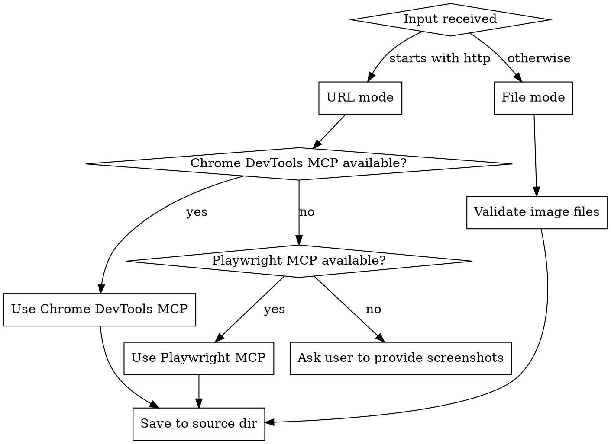

# Screenshot Intake — Structured Discovery

## Purpose

Gather everything needed to build a React/Vue/Svelte/React Native app from screenshots or a live URL in a single structured pass. Captures pages, analyzes them with Claude vision, asks the user only what cannot be derived, and writes `.claude/plans/build-spec.json` that downstream phases consume without re-asking questions.

## When to Use

- First phase of the `/build-from-screenshot` pipeline
- A user provides a URL and says "build something like this" or "clone this site"
- A user provides screenshot image paths and wants to build from them
- No Figma or Canva source is available, only screenshots or live pages

## Inputs

- **One of:**
  - URL (`http://` or `https://`) — captured via browser MCP
  - One or more image file paths (`.png`, `.jpg`, `.webp`)
- **Optional:** Existing project directory to integrate into
- **Reads:** `.claude/pipeline.config.json` for screenshot settings under `screenshot`

## Process

### Step 1: Determine Source Mode and Capture



#### Option A: URL capture mode

**Tool selection:**

| Tool | When to use |
|------|-------------|
| Chrome DevTools MCP (`mcp__chrome-devtools__*`) | **Default.** Lighter weight, faster startup, integrated with Lighthouse audits. |
| Playwright MCP (`mcp__playwright__*`) | Site requires WebKit/Firefox-specific behavior, needs persistent context, or Chrome DevTools is unavailable. |
| Manual fallback | Both MCPs unavailable, URL behind auth, CORS blocked, or rate limiting blocks capture. |

**Capture steps (Chrome DevTools MCP):**

```
1. mcp__chrome-devtools__new_page (or select existing)
2. mcp__chrome-devtools__navigate_page → URL
3. Wait for network idle + screenshot.capture.waitAfterLoadMs (default 1000ms)
4. For each viewport in pipeline.config.json > screenshot.urlCapture.viewports:
   a. mcp__chrome-devtools__resize_page → width, height
   b. mcp__chrome-devtools__take_screenshot → fullPage: true, format: png
   c. Save as .claude/visual-qa/screenshots/source/page-1-{viewportName}.png
5. mcp__chrome-devtools__evaluate_script → extract nav links:
   Array.from(document.querySelectorAll('a[href]'))
     .map(a => ({ href: a.href, text: a.textContent.trim() }))
     .filter(a => a.href.startsWith(location.origin) && a.href !== location.href)
     .slice(0, 20)
6. If links found: ask user which to capture (see Step 1.1 multi-page handling)
```

**Capture steps (Playwright MCP fallback):**

```
1. mcp__playwright__browser_navigate → URL
2. mcp__playwright__browser_wait_for → networkidle (or 1000ms)
3. For each viewport:
   a. mcp__playwright__browser_resize → width, height
   b. mcp__playwright__browser_take_screenshot → fullPage: true
   c. Save as .claude/visual-qa/screenshots/source/page-1-{viewportName}.png
4. mcp__playwright__browser_evaluate → extract nav links (same query as above)
```

**Manual fallback:**

```
If both MCPs fail or are unavailable:
1. Inform user: "I can't capture this URL automatically. Possible reasons: site behind auth, CORS blocked, MCP unavailable, or rate limiting."
2. Ask the user to capture screenshots manually (browser → Save Page As, or use a screenshot tool).
3. Request file paths and switch to File mode (Option B).
4. Record fallback in build-spec.json: "screenshot.captureMode": "manual"
```

#### Option B: File mode

```
1. Glob/validate each provided path:
   - Exists and is readable
   - Is a supported image format (.png, .jpg, .jpeg, .webp)
   - Dimensions >= 1024px wide (warn if smaller — affects vision accuracy)
2. Copy (do not move) each file to .claude/visual-qa/screenshots/source/
   Preserve original filenames where unambiguous; otherwise rename:
   page-1-desktop.png, page-2-desktop.png, ...
3. Record original paths and dimensions in build-spec.json
```

### Step 1.1: Multi-Page Handling

A "page" here means a distinct screen/route in the target app, not a viewport variant of the same page.

**URL mode with detected nav links:**

```
1. List up to 20 same-origin links with their visible text.
2. Ask user (single question):
   "I detected these N internal pages. Which should I capture?
    [Numbered list]
    a) All (default)
    b) Selection (provide numbers)
    c) Homepage only"
3. For each selected link: repeat Step 1 capture flow at all viewports.
4. Store each captured page in .claude/visual-qa/screenshots/source/
   with naming: page-{index}-{viewportName}.png
```

**File mode with multiple files:**

```
1. Group files by likely page (heuristic: filename contains "home"/"about"/"pricing"
   OR sequential numbering OR identical aspect ratio).
2. Confirm grouping with user if ambiguous:
   "I see N files. Are these all the same page at different viewports,
    or do they represent N separate pages?"
3. Update naming: page-{N}-{viewport}.png
```

**Single page (default):**

```
1. If only one URL/file and no nav links detected, treat as a single-page app.
2. Set pages: [{ name: "Home", route: "/", screenshotPath: "..." }] in build-spec.
3. Do not ask multi-page questions.
```

### Step 2: Vision Analysis

For each captured screenshot (use desktop viewport as primary, mobile as supplementary), prompt Claude to extract:

```
1. Page structure
   - Distinct sections (hero, nav, features, pricing, footer, sidebar, etc.)
   - Layout pattern (grid, flex, sidebar+main, stacked, dashboard)
   - Responsive hints (column counts at each viewport)

2. Component candidates
   - Buttons (variants: primary, secondary, ghost, link)
   - Inputs, cards, modals, navbars, footers, tabs, accordions
   - Repeated patterns suggesting reusable components

3. Visual hierarchy
   - Heading levels (H1-H4) inferred from size/weight
   - Primary vs secondary actions
   - Content grouping and spacing patterns

4. Text content
   - All visible text (headings, body, labels, CTAs, placeholders)
   - Distinguish placeholder/lorem from real content if possible

5. Confidence
   - For each component: high/medium/low
   - Note any region with low contrast, occlusion, or compression artifacts
```

Store extracted data in working memory for Step 4 (questions) and Step 5 (build-spec output).

### Step 3: Local Project Scan

```
1. Detect framework via the renderer registry:
   - Run: node scripts/renderer-registry.js detect . --json
   - On { "renderer": "<name>", "language": "<lang>" }:
       set build-spec renderer = <name>
       set build-spec outputTarget = <language>  (react | vue | svelte | react-native)
   - On { "renderer": null }:
       no framework detected → ask user (Q3 below)
   Do not hand-sniff config files or package.json deps; the registry owns detection.

2. Detect app type:
   - manifest.json with "manifest_version" → chrome-extension
   - manifest.json with "start_url" or "display" → pwa
   - Otherwise → web-app

3. Inventory existing components:
   Glob: src/components/**/*.{tsx,vue,svelte}, app/components/**
   Record name, props interface (if detectable), file path.

4. Check package.json for libraries:
   UI: @shadcn/ui, @radix-ui/*, @headlessui/*, naive-ui, vuetify, skeletonlabs
   Style: tailwindcss, @emotion/*, styled-components, unocss
   State: zustand, jotai, pinia, @tanstack/*-query

5. Check for existing tokens:
   tailwind.config.* (theme.extend), src/styles/tokens.css,
   design-tokens.lock.json (from prior run).

6. Load pipeline config:
   Read .claude/pipeline.config.json (screenshot, appTypes sections).
```

### Step 4: Ask Targeted Questions (Max 6)

Only ask what cannot be derived from captures or local scan. Use `AskUserQuestion` tool with multiple questions in one prompt where possible.

**Q1 — Scope (always):**
> Which pages should I build?
> a) All N detected pages (default)
> b) Specific selection (provide numbers)
> c) Homepage only

**Q2 — Component confirmation (always):**
> I detected these components from the screenshots. Confirm or correct:
> [Table: name | confidence | suggested action]
>
> Since detection is vision-based, low-confidence rows are worth a second look.

**Q3 — Output target (only if no framework detected):**
> Run `node scripts/renderer-registry.js list --json` and present the returned
> renderer names as the choices (each entry has `name` and `language`):
> "Which renderer should I build this in? [numbered list of registry renderers]"
> Default: `vite` (React) for new projects.
> Set build-spec `renderer` = the chosen name and `outputTarget` = its `language`.

**Q4 — Component reuse (only if existing components detected):**
> I found N existing components that match detected components.
> a) Reuse and only generate missing ones (recommended)
> b) Regenerate all from screenshots (replaces existing)
> c) Generate alongside with new names (no overwrites)

**Q5 — Business logic (always):**
> Are there interactions beyond what's visible (form validation rules, API calls, auth requirements, state machines)?
> Default: pure presentational.

**Q6 — Integration (only if existing project detected):**
> a) Standalone app (new project scaffold)
> b) Integrate into the existing project at [detected path]

### Step 5: Generate build-spec.json

Write `.claude/plans/build-spec.json`. The schema is consumed by `canva-token-inference` (Phase 2), `tdd-from-figma` (Phase 3), and the framework-specific converter agents (Phase 4).

**Concrete example (single-page React from URL):**

```jsonc
{
  "version": "1.0.0",
  "source": "screenshot",
  "outputTarget": "react",
  "createdAt": "2026-05-21T14:30:00Z",
  "screenshot": {
    "inputType": "url",
    "sourceUrl": "https://example.com",
    "captureMode": "chrome-devtools-mcp",
    "capturedScreenshots": [
      ".claude/visual-qa/screenshots/source/page-1-desktop.png",
      ".claude/visual-qa/screenshots/source/page-1-mobile.png"
    ],
    "viewports": [
      { "name": "desktop", "width": 1440, "height": 900 },
      { "name": "mobile", "width": 375, "height": 812 }
    ]
  },
  "appType": "web-app",
  "framework": {
    "type": "vite",
    "version": "6.0.0",
    "outputDir": "src"
  },
  "styling": {
    "approach": "tailwind",
    "uiLibrary": "shadcn",
    "existingTokens": false
  },
  "pages": [
    {
      "name": "Home",
      "route": "/",
      "screenshotPath": ".claude/visual-qa/screenshots/source/page-1-desktop.png",
      "sections": ["nav", "hero", "features", "pricing", "footer"]
    }
  ],
  "components": [
    {
      "detectedName": "Primary Button",
      "confidence": "high",
      "reactName": "Button",
      "category": "ui",
      "action": "generate",
      "existingPath": null,
      "variants": ["primary", "secondary", "outline"],
      "props": ["variant", "size", "disabled", "children"]
    },
    {
      "detectedName": "Pricing Card",
      "confidence": "medium",
      "reactName": "PricingCard",
      "category": "composite",
      "action": "generate",
      "existingPath": null,
      "props": ["title", "price", "features", "ctaText", "highlighted"]
    }
  ],
  "textContent": {
    "hero-heading": "Build faster with AI",
    "hero-subheading": "Ship production apps in days, not months",
    "cta-primary": "Get Started"
  },
  "businessLogic": {
    "forms": [],
    "apiCalls": [],
    "auth": null,
    "stateManagement": null
  },
  "e2e": {
    "strategy": "navigate-interact-verify",
    "flows": [
      {
        "name": "homepage-render",
        "description": "Load homepage and verify all sections render",
        "steps": [
          "navigate to /",
          "verify nav visible",
          "verify hero heading text",
          "verify CTA button clickable"
        ]
      }
    ]
  },
  "testStrategy": {
    "unit": true,
    "e2e": true,
    "visual": true,
    "crossBrowser": false,
    "coverageThreshold": 80
  },
  "options": {
    "componentReuse": "reuse",
    "integration": "standalone"
  }
}
```

**Multi-page variant:** include one entry per page in `pages[]`, with distinct `screenshotPath` and `route`. Add a `page-navigation` flow to `e2e.flows` enumerating route transitions.

**File-mode variant:** set `screenshot.inputType` to `"files"`, `sourceUrl` to `null`, and `captureMode` to `"file"`. Record original paths in a `screenshot.originalPaths` array.

**Manual-fallback variant:** set `captureMode` to `"manual"`.

### Step 6: Confirm and Proceed

Present a build plan summary and wait for confirmation:

```
## Build Plan Summary
- Source: Screenshot (URL: https://example.com)
- Capture mode: Chrome DevTools MCP
- Pages: 3 (Home, Pricing, Dashboard)
- Components: 12 to generate (8 high, 3 medium, 1 low confidence)
- Existing to reuse: 4
- Output target: React + Vite (tailwind + shadcn)
- App type: web-app
- Token inference: AI-powered (will need your confirmation in Phase 2)

Proceed with token inference?
```

Do not continue until the user confirms.

## Output

| Artifact | Path |
|----------|------|
| Build spec | `.claude/plans/build-spec.json` |
| Captured screenshots | `.claude/visual-qa/screenshots/source/page-{n}-{viewport}.png` |
| Build plan summary | Displayed to user (not written to disk) |

## Error Handling

| Failure | Recovery |
|---------|----------|
| **URL unreachable** (network error, DNS failure) | Retry once. If still failing, ask user to verify URL, then fall back to file mode. |
| **URL behind auth** (401/403, login wall) | Cannot bypass. Ask user to log in and provide screenshots manually (file mode). |
| **CORS or bot detection** (page captures blank or 403) | Try Playwright MCP fallback (often less detectable). If still blocked, request manual screenshots. |
| **Rate limiting** (429) | Wait 60s, retry once. If persistent, ask user to wait and re-invoke later. |
| **Both MCPs unavailable** | Inform user. Ask them to install at least one MCP, or provide screenshots manually. |
| **Image file missing/unreadable** | List affected paths. Ask user to verify paths or re-provide. |
| **Image resolution too low** (<1024px wide) | Warn that vision accuracy will degrade. Ask whether to proceed or provide higher-res images. |
| **Image corrupted** (decode failure) | List affected files. Ask user to re-export or provide alternatives. |
| **Vision analysis low confidence on most components** | Warn user. Offer to: (a) proceed with low-confidence flags marked in build-spec, (b) capture additional zoomed-in screenshots of key sections, (c) provide manual component list. |
| **Multi-page nav detection returns 0 links on a known multi-page site** | Treat as single-page. Mention to user that no internal links were detected — ask if they want to provide additional URLs. |
| **User selects a viewport not in config** | Add the requested viewport to the build-spec but warn that some downstream phases (visual-diff, responsive) may not test it by default. |
| **Existing build-spec.json present from prior run** | Ask: "Reuse existing build-spec, regenerate, or merge?" — default to reuse if `source` matches. |

## Integration

- **Consumed by:** `canva-token-inference` (Phase 2 of `/build-from-screenshot`), `tdd-from-figma` (Phase 3), framework converter agents (Phase 4), `/build-from-screenshot` orchestrator
- **Uses:** Chrome DevTools MCP (preferred), Playwright MCP (fallback), Claude vision, `AskUserQuestion`, `Glob`, `Read`, `Write`
- **Config keys read:** `pipeline.config.json` → `screenshot.*`, `appTypes.*`, `screenshotCapture.*`
